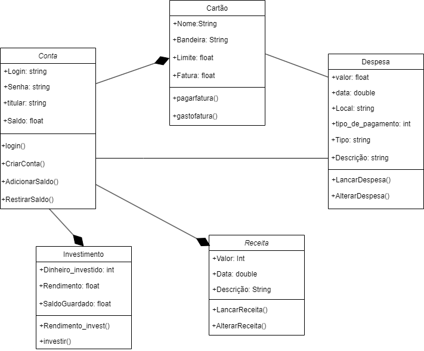
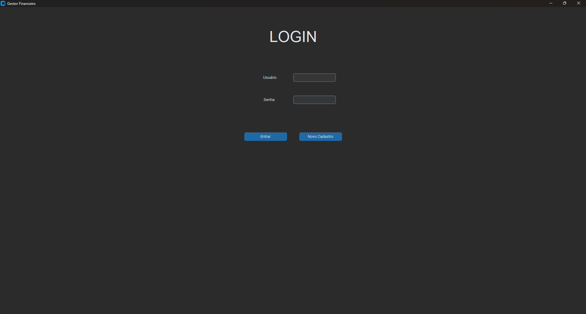
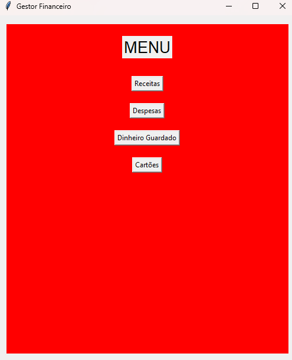
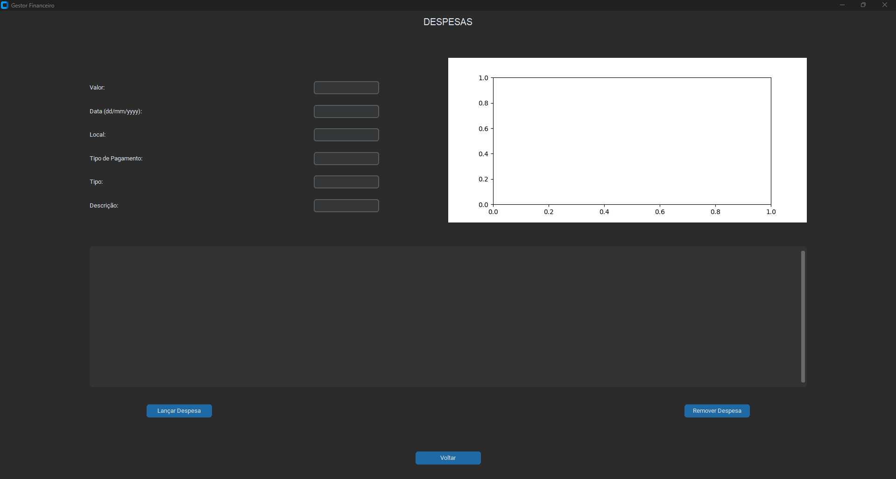
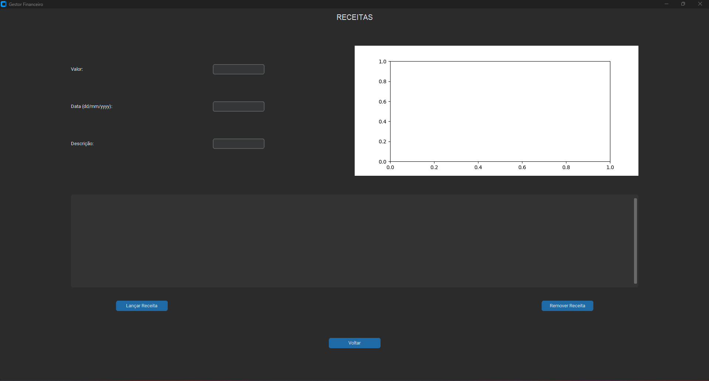
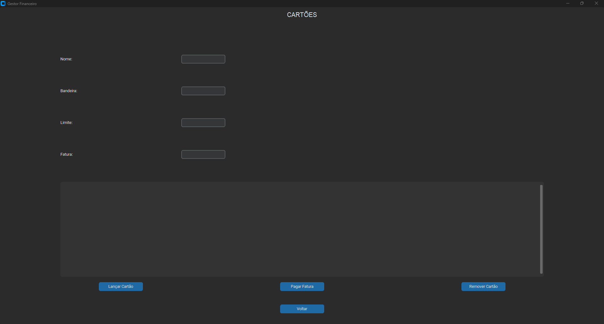
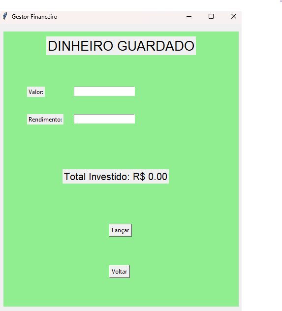

# Gestor-Financeiro
Grupo: Luciano Damitz Pinheiro, Douglas Francisco Bolina Sibuya
 - Conceito: Desenvolver uma aplicação para realizar gestão financeira de modo a auxiliar o usuário a tomar decisões mais conscientes sobre seu dinheiro de forma intuitiva e que seja de fácil utilização. 
 - Função: O programa possuirá mecanismo para registrar de despesas, receitas, dinheiro guardado, programa de pontos, informações sobre os cartões de crédito e de débito e investimentos. A ferramenta também fornecerá visualizações com gráficos diários, semanais, mensais e anuais informando como o dinheiro está sendo usado, facilitando o usuário a ter consciência sobre como utilizar melhor seu dinheiro e tomar decisões sobre sua vida financeira a curto e a longo prazo de  modo a auxiliar o usuário a atingir seus objetivos. 
 - Motivação: Muitas pessoas têm dificuldade de gerir os seus recursos financeiros e com esse intuito projeto visa facilitar essa gestão de forma simplificada e descomplicada melhorando os hábitos financeiros e auxiliando para que os usuários realizem seus sonhos e atinjam seus objetivos.

## Diagrama de Classes

## Fluxograma

## Tutorial
O programa será feito em Python e será utilizada a biblioteca Tkinter para confecção de sua interface gráfica. Ao realizar uma instalação padrão de Python, o Tkinter já deve ser instalado junto. Para confirmar, é possível verificar utilizando o seguinte comando no prompt de comando: “pip install tk”. Estando o Python e a biblioteca Tkinter devidamente instalados e prontos para uso, pode-se começar a criar a interface gráfica. Como exemplo, temos o seguinte código:

import tkinter as tk

#Criar a janela principal

janela = tk.Tk() 

#Definir o título da janela

janela.title("Minha primeira aplicação Tkinter")

#Tamanho da janela

janela.geometry("400x300")

#Iniciar o loop da aplicação

janela.mainloop()

Na imagem abaixo é possível ver a janela criada com o código acima.

## Esboço GUI

#### Tela de login

#### Menu

#### Lançamento de Despesas

#### Lançamento de Receitas

#### Gerenciamento de Cartões

#### Tela de dinheiro investido

