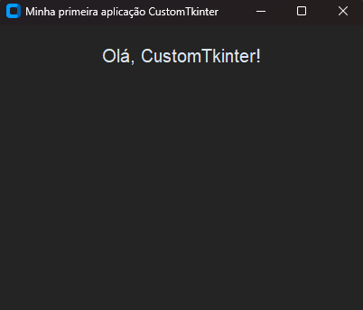

# Gestor-Financeiro
Grupo: Luciano Damitz Pinheiro, Douglas Francisco Bolina Sibuya
 - Conceito: Desenvolver uma aplicação para realizar gestão financeira de modo a auxiliar o usuário a tomar decisões mais conscientes sobre seu dinheiro de forma intuitiva e que seja de fácil utilização. 
 - Função: O programa possuirá mecanismo para registrar de despesas, receitas, dinheiro guardado, programa de pontos, informações sobre os cartões de crédito e de débito e investimentos. A ferramenta também fornecerá visualizações com gráficos diários, semanais, mensais e anuais informando como o dinheiro está sendo usado, facilitando o usuário a ter consciência sobre como utilizar melhor seu dinheiro e tomar decisões sobre sua vida financeira a curto e a longo prazo de  modo a auxiliar o usuário a atingir seus objetivos. 
 - Motivação: Muitas pessoas têm dificuldade de gerir os seus recursos financeiros e com esse intuito projeto visa facilitar essa gestão de forma simplificada e descomplicada melhorando os hábitos financeiros e auxiliando para que os usuários realizem seus sonhos e atinjam seus objetivos.


## Diagrama de Classes


## Fluxograma


## Tutorial
O programa será feito em Python e será utilizada a biblioteca CustomTkinter para confecção de sua interface gráfica. Para realizar a instalação do CustomTkinter pode-se utilizar o seguinte comando no prompt de comando: “pip install customtkinter”. Estando o Python e a biblioteca CustomTkinter devidamente instalados e prontos para uso, pode-se começar a criar a interface gráfica. Como exemplo, temos o seguinte código:

### Instalação

Para instalar o CustomTkinter, utilize o seguinte comando no prompt de comando:

```bash
pip install customtkinter 
```

#### Criar a janela principal

```bash
janela = ctk.CTk()
```

#### Definir o título da janela

```bash
janela.title("Minha primeira aplicação CustomTkinter")
```

#### Tamanho da janela
```bash
janela.geometry("400x300")
```

#### Adicionar um rótulo com uma mensagem
```bash
label = ctk.CTkLabel(janela, text="Olá, CustomTkinter!", font=("Arial", 20))
label.pack(pady=20)
```
#### Iniciar o loop da aplicação
```bash
janela.mainloop()
```



#### Configurar o layout da janela para centralizar os widgets
Para centralizar os widgets na janela, configure o layout utilizando grid_rowconfigure e grid_columnconfigure: \\
```bash
janela.grid_rowconfigure(0, weight=1) 
janela.grid_rowconfigure(1, weight=1) 
janela.grid_rowconfigure(2, weight=1) 
janela.grid_rowconfigure(3, weight=1) 
janela.grid_columnconfigure(0, weight=1) 
```

#### Adicionar um botão
Adicione um botão que executa uma função quando clicado: \\
```bash
def funcao_exemplo():
    print("Botão clicado!")

botao = ctk.CTkButton(janela, text="Clique Aqui", command=funcao_exemplo)
botao.pack(pady=10)
```

#### Adicionar uma entrada de texto
Inclua um campo de entrada de texto para que o usuário possa digitar informações:\\
```bash
entrada = ctk.CTkEntry(janela, placeholder_text="Digite algo aqui")
entrada.pack(pady=10)
```

#### Adicionar uma caixa de seleção
Adicione uma caixa de seleção para opções adicionais:\\
```bash
checkbox = ctk.CTkCheckBox(janela, text="Opção")
checkbox.pack(pady=10)
```

#### Usando grid para posicionamento mais preciso
Utilize o método grid para posicionar widgets de forma mais precisa na janela:\\
```bash
label.grid(row=0, column=0, padx=10, pady=10)
botao.grid(row=1, column=0, padx=10, pady=10)
```

#### Definir o modo de aparência: 'light', 'dark', ou 'system'
Escolha entre os modos de aparência disponíveis: 'light', 'dark' ou 'system' (que segue a configuração do sistema operacional).\\
```bash
ctk.set_appearance_mode("dark")
```

#### Definir o tema de cor: 'blue', 'green', 'dark-blue'
Selecione o tema de cor desejado, como 'blue', 'green', 'dark-blue', entre outros.\\
```bash
ctk.set_default_color_theme("blue")
```


## Esboço GUI

#### Tela de login


#### Menu


#### Lançamento de Despesas


#### Lançamento de Receitas


#### Gerenciamento de Cartões


#### Tela de dinheiro investido


